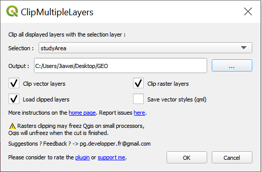

```{r setup, include=FALSE}
knitr::opts_chunk$set(echo = FALSE)
```

# 1.0 Data Source

Download all the data sources from the following links:

DataSource | DataFormat | Description | Link
------------- | ------------- | ------------- | -------------
Indonesia Geospatial|	Shape files |	OSM Buildings |	https://www.indonesia-geospasial.com/2020/12/download-shp-pemukiman-detail-seluruh.html
Indonesia Geospatial|	Shape files |	PENAJAM PASER UTARA |	https://www.indonesia-geospasial.com/2020/01/shp-rbi-provinsi-kalimantan-timur.html
Indonesia Geospatial|	Shape files |	KUTAI KARTANEGARA |	https://www.indonesia-geospasial.com/2020/01/shp-rbi-provinsi-kalimantan-timur.html
Indonesia Geospatial|	Shape files |	KOTA SAMARINDA |	https://www.indonesia-geospasial.com/2020/01/shp-rbi-provinsi-kalimantan-timur.html
Indonesia Geospatial|	Shape files |	KOTA BALIKPAPAN |	https://www.indonesia-geospasial.com/2020/01/shp-rbi-provinsi-kalimantan-timur.html
Indonesia Geospatial|	Shape files |	Titik Api Hotspot se-Indonesia Tahun 2014 - 2019 |	https://www.indonesia-geospasial.com/2020/04/shapefile-shp-titik-api-hotspot.html
Indonesia Geospatial|	Shape files |	Geology Kalimantan Timur |	https://www.indonesia-geospasial.com/2020/03/download-data-shapefile-shp-geologi-se.html
Indonesia Geospatial|	Shape files |	East BATAS DESA DESEMBER 2019 DUKCAPIL KALIMANTAN TIMUR (Villiage boundary and population data for East Kalimantan 2019)	 |	https://www.indonesia-geospasial.com/2020/04/download-shapefile-shp-batas-desa.html
Indonesia Geospatial|	TIF files |	Provinsi Kalimantan Timur |	https://www.indonesia-geospasial.com/2020/01/download-dem-srtm-30-meter-se-indonesia.html


# 2.0 Data Extraction
## 2.1.2 Data extraction for study area


When we download the **BATAS_DESA_DESEMBER_2019_DUKCAPIL_KALIMANTAN_TIMUR** layer, it contains all the sub-districts, thus we need to extract the parts we focus on.

Right click on the **BATAS_DESA_DESEMBER_2019_DUKCAPIL_KALIMANTAN_TIMUR** layer, click **Open Attribute Table**

Click on Select by Expression

In the newly opened window, choose Fields: **KECAMATAN**
Click **"All Unique"** and select these areas we need as shown below: 

Click **Select Features** when the expression is completed.

Go back to the main map, and we will see these areas are selected

Right click on the **BATAS_DESA_DESEMBER_2019_DUKCAPIL_KALIMANTAN_TIMUR** layer, click **Export** > **Export Selected Features As**


Select the GeoPackage you want to save this layer to, and name this layer as *studyArea*
Make sure the CRS is **EPSG:23845 - DGN95 / Indonesia ™-3 zone 54.1**


Click OK when everything is done
Now we are able to see the study area which we will focus on

Up to here, we are done for the studyArea layer extraction.


## 2.2 Data selection for topographical data layers

For the topographical data layers of East Kalimantan. You are required to download data of **Kota Balikpapan**, **Kota Samarinda**, **Penajam Paser Utara** and **Kutai Kartanegara**. We translate the layer name to English and select these layers we need as below:

* Administrasi - Administration
* Administrasi Kecamatan - Administration Districts
* Agrikebun - Agriculture
* Agriladang - Agrifield
* Agrisawah - Agriculture
* Airport - Airport
* Bangunan - Building
* Bendung - Dam
* Bendungan - Dam
* Danau - Lake
* Depogas - Gas Depot
* Depominyak - Oil Depot
* Dermaga - Dock
* Gardulistrik - Power house
* Genlistrik - electricity  
* Hankam - Defense and Security
* Heliport - Heliport
* Irigasi - Irrigation
* Jalan - Street
* Jembatan - Bridge
* Kabel Listrik - Power cable
* Kanal- canal
* Kantor Air Minum -  drinking area
* Kantor Pos - Post office
* Kontur - Contour
* Layanan Kesehatan - Health services
* Menara Exploit Minyak - Oil Exploit Tower
* Menara Listrik - Electric Tower
* Menara Telepon - Telephone Tower
* Niaga - Commerce
* Nonagrialang - farming  
* Non Agri Hutan Basah - Non Agri Wet Forest
* Non Agri Hutan Kering - Non Agri Dry Forest
* Non Agri Semakbelukar - Non Agri Shrub
* Olahminyak - Petroleum processing
* Pelabuhan - Harbor
* Pemerintahan - Government
* Pemukiman - Settlement
* Pendidikan - Education
* Pesisir - Coastal
* Pipahidrokarbon - Hydrocarbons  
* Pusekemas - Health Center
* Rawa -  Swamp
* Rumahsakit - Hospital
* Runway - Runway
* Sumurminyak - oil well
* Sungai - River
* Tamanwisata - park
* Tambak - pond
* Tambang - Mine
* Taxiway - Taxiway
* Terowong - Tunnel
* Waduk - reservoir


## 2.3 Data extration for topographical data layers

However, not all the layers are within our studyArea, as shown below


So we need to clip these layers within our studyArea.
We need to use a plugin tool to help us achieve it.

Click **Plugins** > **Manage and Install Plugins**.
Type in the plugin name: **Clip Multiple Layers**, and **install** this plugin.

After installation is done, select these layers we need as stated in the above section.


Next,make sure all the layers that need to be clipped are selected, **except studyArea**
And now click on the plugin we just installed


And in the pop-up window, choose Selection: **studyArea**
Select an output folder to store all the output layers


Click **OK** when is done.
It will take a while to process the clipping, after that you will be able to see the output layers


Now the output layers all fit into our studyArea.
Repeat the above steps for other layers for different sub-districts.
