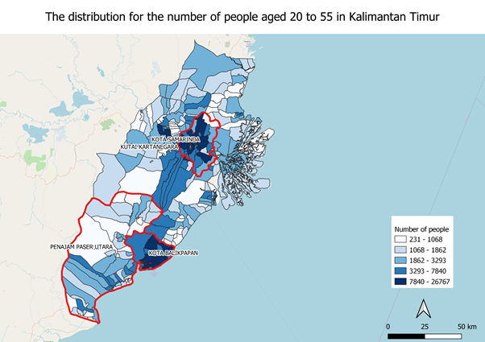
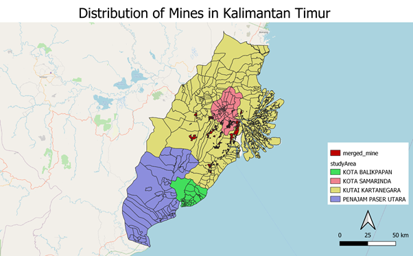
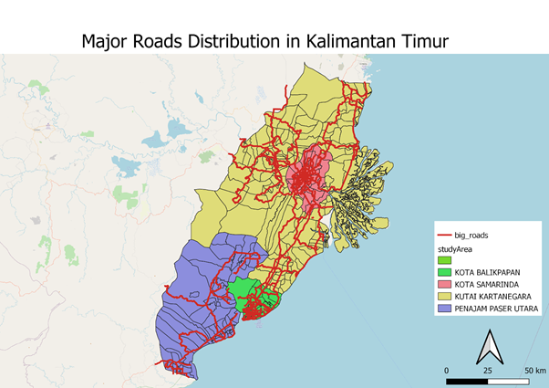
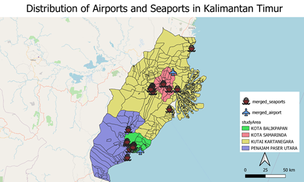
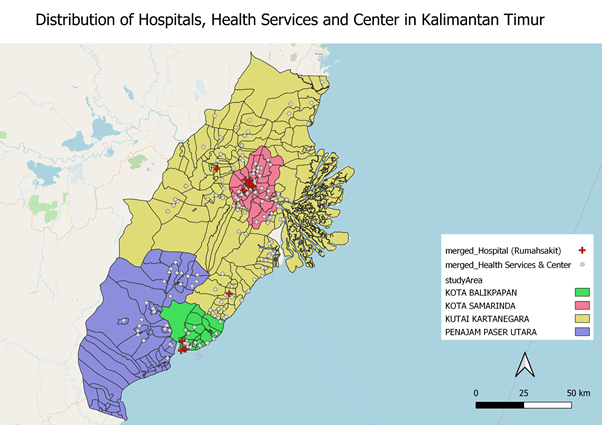
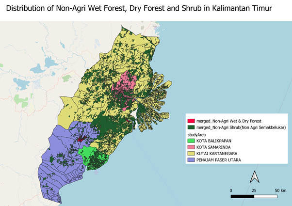
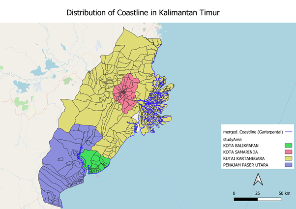

```{r, include=FALSE}
knitr::opts_chunk$set(echo = FALSE,
                      warning = FALSE,
                      tidy = FALSE,
                      message = FALSE,
                      fig.align = 'center',
                      out.width = "100%")
options(knitr.table.format = "html") 
```


```{css, echo=FALSE}
div{
color: #D0EFFF;
}

.section{
  background-color: #D0EFFF;
}

h1{
  bg-color: #2A9DF4;
  color:#000000;
}


```

# Team J Cube

<center>


James Pang Jun Jie

Jiali Huo

Jiawei Yao
</center>
# Introduction

In 2019, President Joko Widodo announced a plan to relocate the capital to Kalimantan, to a more central location within Indonesia. Part of Kutai Kartanegara Regency and Penajam North Paser Regency in East Kalimantan will be carved out to create a new province-level planned city.

```{r, include=FALSE}
knitr::write_bib(c('posterdown', 'rmarkdown','pagedown'), 'packages.bib')
```

# REPORT OF SURVEY

## Population and Demographic
<center>

</center>
From the number of people aged 20 to 55 distribution map, we can see that the young and mid-aged people are mainly located in Kota Samarinda and Kota Balikpapan. This group is representative in terms of industry advancement and higher proportion means the area is more labor intensive. 

## Economic and Businesses
<center>

</center>
This graph shows the distribution of mines in the study area. It is seen that mines are concentrated in and around Samarinda, where mining activities were once popular in. Penjamin Paser Utara and Balikpapan do not have these. Land used for mining could be a consideration as it would involve additional economic cost.

## Transport and Communication
<center>

</center>
The graph shows a distribution of major road networks in the study area. It can be seen that the network of roads is relatively dense in Samarinda and Balikpapan. The network is quite sparse in Kutai Kartanegara and Penjaman Paser Utara, indicating lesser accessibility in these areas.

<center>

</center>

This graph shows the distribution of airports and seaports (harbour and docks). There are two airports, one in Balikpapan and the other in Samarinda. These two areas would be more accessible due to the larger number of islands in Indonesia. For seaports, there are two clusters, one near Balikpapan and Penjaman Paser Utara and the other cut across Samarinda. Seaports are useful for shorter distance travel as well as cargo shipment.

## Infrastructure
<center>

</center>
Surprisingly, the number of hospitals in East Kalimantan is not many.  However, there are a lot of Health Services & Centers and they are evenly distributed in East Kalimantan. Kota Samarinda and Kota Balikpapan are more populous and more developed. In contrast, the medical conditions will also be better.

## Environment and Hazard
<center>

</center>
East Kalimantan has an area of 21,144 km2 which occupies about 11% of the whole country. From the map above, we can see the distribution of Non-Agri Wet Forest, Dry Forest and Shrub. The area of forest and shrubs can cover almost the entire East Kalimantan.

<center>

</center>
From the map above, we can see the blue line is the coastline for East Kalimantan. East Kalimantan has a tropical climate with two seasons, the dry season and the rainy season. Moreover, because it is close to the sea, the temperature depends on the area of the ocean surface and the distance from the beach.

# Introduction
