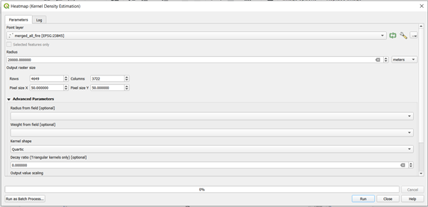
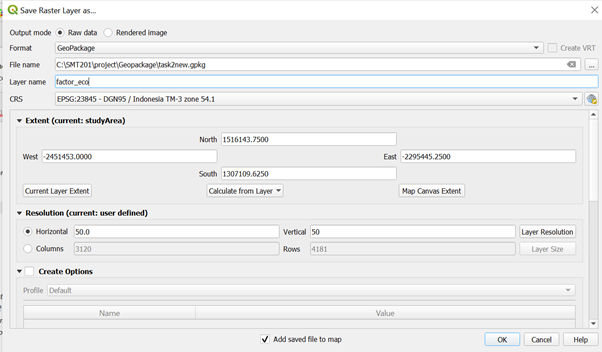

```{r setup, include=FALSE}
knitr::opts_chunk$set(echo = FALSE)
```


# 1.0 Introduction

## 1.1 Layers we need

Layers we need:

Requirements | Layer  |
------------- | ------------- 
It should avoid steep slope. |	slope	
It should be away from potential natural disaster risk areas such as sea coasts, major rivers and volcanoes.|	Merged_coastline, merged_river
It should be near to current urban settlement areas but not at the current major settlement areas.|merged_osm
It should avoid natural forest as much as possible. |merged_forest
It should avoid areas prone to forest fire.|merged_fire
It should be highly accessible via road transport|merged_street
It should be near to airport(s) and seaport(s).|merged_transport

## 1.2 Volcano analysis

According to our research on volcano distribution in Indonesia, we found out that there are 147 volcanoes in Indonesia as of 2021. Most of the volcanoes are distributed in Java and Sumatra area (Volcanoes of Indonesia 2021)


The hazard level of volcano for Kalimantan Timur is very low due to no active volcano in Kalimantan Timur(Kalimantan Timur 2021). This shows the impact of volcanic eruption is unnecessarily needed to take into consideration when determining the site selection for the new capital city. Therefore, we conclude that the volcano distribution factor will not affect the site selection in our analysis.

## 1.3 Computing slope
From the menu bar, select **Raster** -> **Analysis** -> **Slope**. Slope dialog window appears.
For **Input layer**, select **DEM** from the drop-down list.
Keep the rest of the setting as default.
Click on the **Run** button.
When the computation is completed, a temporary layer called Slope will be added in the QGIS project.


Export the temporary layer to Geopackage, name it to **Slope**.
Click **Calculate From Layer** -> Choose **StudyArea**.
Horizontal: **5**
Vertical: **5**
Click **OK**.


## 1.4 Computing forest fire density
### Creating density for forest fires
We will use the merged_all_fire to create a density map for forest fires. 
Search for **“kernel density”** in the processing toolbox and select **“Heatmap (Kernel Density Estimation)”** as shown below


A window will appear and fill in the fields as such.

* Point Layer: **merged_all_fire**
* Radius: **20000**
* Pixel Size X: **50**
* Pixel Size Y: **50**




* Click on **Run**
Notice that a temporary layer called Heatmap has been added in QGIS project.
Export the rasterized layer to Geopackage and name it as **merged_fire_density layer**.

* We can modify the symbology of this layer to gain better clarity of the resulting layer.
* Go to its **Properties** -> **Symbology**
* Fill in the fields as such
Render Type: **Singleband Pseudocolour**
Colour Ramp: **Reds**


* Click on **OK**


# 2.0 Computing Factor Data
## 2.1 Computing proximity for all the merged layers

### 2.1.1 Creating attribute field for rasterising

Merged_Street
Before we can rasterise the Merged_street layer, we need to add a control attribute field in the street layer.

* At the **Layers** panel, click on **Merged_street** layer to make it active.
* From the icon bar, click on the Open **Attribute Table** icon .
The attribute table of **Merged_street layer** appears.

* From the menu bar of the Merged_street layer attribute table, click on the **Open field calculator** icon.
The Field Calculator dialog window appears.

* Keep **Create a new field** option checks.
* For **Output field** name, type POI_CODE.
* At the **Expression** pane, type 1.

Your screen should look similar to the figure below.


* Click on **OK** button to run the function.
Notice that a new field called POI_CODE has been added into the attribute table of **Merged_street** GIS layer. Also note that all the records are indicated with POI_CODE values equals to 1.

### 2.1.2 Rasterising Merged_Street layer

Now we need to rasterize all the merged layers in the table above.

From the menu bar, select **Raster -> Conversion -> Rasterise (Vector to Raster)**.


In the Rasterize (Vector to Raster) window, 

* Choose Input layer: **Merged_Street**
* For Field to use for a burn-in value, select **POI_CODE** from the drop-down list.
* Output raster size units: **Georeferenced units**
* Width: **50**
* Height: **50**
* For Output extent, click on **Calculate from Layer**.
* Select **DEM** from the drop-down list.

When you are ready, Click on **Run** button.


When the operation ended, the dialog window will display the operation log.

* Read the output display to ensure that the process has completed without any error.
After confirming that there is no error. You can close the dialog window.

* Click on **Close** button.

Notice that a temporary layer called **Rasterized** has been added in QGIS project.
Export the rasterized layer to Geopackage and name it as **Rasterized_street** layer.


* Repeat the steps above to generate the raster layers for other **merged layers** in the table above.
* The layers below should be prepared before proceeding.
  + Rasterized_forest
  + Rasterized_river
  + Rasterized_coastline
  + Rasterized_Transportation(Seaport & Airport)
  + Rasterized_studyArea


For the **Settlement** part, we are going to use different steps to achieve the raster layer.
We need to create a buffer layer for the merged_osm layer, because there are about 512,000 polygons of data in the merged_osm layer. Creating the buffer and dissolving them will improve the efficiency of exporting.

* Click on merged_osm layer. Then go **Vector-> Geoprocessing Tools -> Buffer**
* Distance: **100m**
* Check **Dissolve result**


* A temporary layer called Buffer will be shown. Export it to Geopackge and name it as Merged_osm_buffer.
* Rasterized the Merged_osm_buffer layer by following the steps above to get Raterized_osm_buffer.

### 2.1.3 Working with Proximity function of QGIS

Now we will create a proximity layer:
Click Raster > Analysis > Proximity (Raster Distance)
The Proximity (Raster Distance) dialog window appears.

* For **Input layer**, select **Rasterized_street** from the drop-down list.
* For **Distance units**, select **Georeferenced coordinates** from the drop-down list.
* For **Output data type**, select Float32 from the drop-down list.


* Click **Run** when you are ready.
* A temporary layer called **Proximity map** is created and added in QGIS project.
* Save the newly computed **proximity map** into GeoPackage format with a resolution of 50 x 50m. Call the layer **prox_street**. Next, remove the **Proximity map** layer from QGIS.


Repeat the steps above to generate the proximity map layers for other **merged layers** in the table above.


* The layers below should be prepared to proceed.
  + Slope
  + prox_forest
  + prox_river
  + prox_coastline
  + prox_Transportation(Seaport & Airport)
  + prox_osm_buffer


# 3.0 Raster-based GIS Multiple‐Criteria Decision Analysis (GIS-MCDA)
## 3.1 Standardising the factor scores

Because of the difference scales upon which criteria are measured, it is necessary that factors be standardized before combination using the formulas below:


## 3.1.1 factor_eco

* To get the **max(x)** value, open the Attribute table of the **Slope** layer.
* Click on the Information tab, scroll down to find the **Max** Value.


* Open the Processing Toolbox, type **Raster calculator**.
* Click on the Raster **calculator**.


Enter the expression below:
**1  -  (  ("slope_@1" -0 ) /  (37.7335624695 - 0 )   ) **


* Reference Layer: **Slope**
* Click on Run button. A temporary layer **Output** will appear.
* Export the layer to **Geopackage**.
* Layer_name: **factor_eco**
* CRS: **23845**
* Calculate from Layer: **StudyArea**
* Horization and Vertical: **50**
* Click **OK**



Now we will get a raster layer like below:


The reason to use 1 minus the equation: 


Hence, we should use the original formula for factor_river, factor_coastline, factor_forest, factor_fire.

Repeat the above steps for other layers as well.


Additionally, after generating the factor_osm layer, we still need to make some adjustments because the requirement is different. It should be near to current urban settlement areas but not at the current major settlement areas. After generating the **factor_osm** layer, we need to change all values from 1(means the current major settlement area) to 0.

We use another **Raster calculator** tool to achieve that. Moreover, the value of the factor_osm layer will decrease when the distance is further away. 

* Open Processing Toolbox, search **Raster calculator**.
* Click the one under **SAGA -> Raster - Calculus**


The configuration window is as shown below:

* The formula is: **ifelse(a=1, 0, a)**
* Grids: **factor_osm**


A temporary layer will come out. Export to Geopackage and name it as **factor_osm_final**.


## 3.2 Performing AHP Analysis

AHP 
Put excel screenshot (red and yellow)

With the AHP scores as shown below.
Put the green part screenshot


Then state the ranking and consistency check

Example: The consistency check of 3% is below 10% and the inconsistency is acceptable.


## 3.3 Computing the Suitability Layer

Use the **factor layers** times **AHP scores**, then add together, times **Rasterized_StudyArea**. Because we want the final output is within the study area.


A temporary layer Output will be shown.


Notice that locations (grids) with values closer to 1 are more suitable than locations with values closer to 0.
Export to Geopackage and name it **AHP_suitability**.


# 4.0  Identifying Suitable Sites

According to the recommendation of a senior planner, the selected site should have at least a composite factor scores of **0.5**. We will take his advise to prepare the final suitability site layer.

* We need to reclass the **AHP_suitability** layer. 
* Find **Reclassify by table** in toolbox, and double click.


* Make sure **Raster layer** is **AHP_suitability**. 
* For the **Reclassification table**, click on the … icon.
* Follow the screenshot below, and click **OK**.


* Click **Run**.
* A temporary layer **Reclassifie_raster** will be shown.  Save the output into GeoPackage format and name the layer as **MCDA_model**.


## 4.1 Vectorise suitable sites

Next, we will convert the suitable site identified above from raster into vector. The process is called vectorisation.

* From the menu bar, select **Raster -> Conversion -> Polygonize(Raster to Vector)**
The Polygonize (Raster to Vector) dialog window appears.
* For Input Layer, select AHP_suitability from the drop-down list.
* For Name of the field to create, type *Sites*.
* Keep the checkbox in front of **Use 8-connectedness** uncheck.


* When you are ready, click on the **Run** button.
* When the computation is completed, a new temporary layer called **Vectorized** will be added on the Layers panel and display on the view window.
* Delete away all the non suitable sites (‘Site’ = 0).


Save the final layer into GeoPackage format. Call the newly created layer **Potential_sites**.


