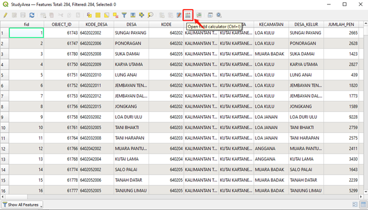

```{r setup, include=FALSE}
knitr::opts_chunk$set(echo = FALSE)
```

# Data preparation

* Population and Demographic
* Economic and Businesses
* Transport and Communication
* Infrastructure
* Environment and Hazard

# Report of Survey

## 1.0 Population and Demographic

### 1.1 Number of people aged 20-55

From the number of people aged 20 to 55 distribution map, we can see that the young and mid-aged people are mainly located in Kota Samarinda and Kota Balikpapan. This group of people is representative in terms of industry advancement for that particular state. The more people that are aged 20 to 55 located at, the more labor intensive this state is. Another aspect we can see from this map is that people prefer to live near the coastline rather than inland.

### 1.2 Religon

As we can see that the distribution of the number of people who believe in Islam is similar to the distribution for the number of people aged 25 - 60 in Kalimantan Timur. The reason for the similar distribution is that Islam is the main religion for most Indonesians. Similarly, the distribution has the largest population in Kota Samarinda and Kota Balikpapan, which are located near the coastline. 


Due to the small proportion of the population for people who believe in religions other than Islam, we are using the same internal method to classify the distribution for the number of people who believe in other religions (Christian, Catholic, Hindu, Buddha, Confucianism, Free Thinker). As we can see from the graph, the largest number of people who believe in other religions are distributed in Kota Balikpapan, and followed by the second largest proportion in Kota Samarinda. There are a few residents in Kutai Kartanegara area which is between Kota Samarinda and Penajam Paser Utara. 

### 1.3 Gender

To study the gender distribution, we use the index which is formulated as the number of males minus the number of females to measure it. As we can see that there are more males than females in Kota Balikpapan and the area between Kota Samarinda. This may indicate that such areas are in development and more labour are needed to build the infrastructure and heavy industries as they would require more male than female for production.

### 1.4 School


In terms of education resources, we have consolidated some schools including junior high schools, high schools and diploma schools in Kalimantan Timur. As we can see that the main schools are located in Kota Balikpapan and Kota Samarinda, similar to the population aged 20 - 55 distribution. This also indicates that these areas have better infrastructure and resources. 


## 2.0 Economic and Businesses

The economy in East Kalimantan revolves around oil and gas processing and to a smaller extent, agriculture. For economic aspects, mines will also be looked into as it was a major economic activity in Samarinda. Thus, when relocating the city, the areas used for the major economy in the study area would be looked into so that minimal disturbance to these areas would be taken into consideration. 

### 2.1 Agriculture


This graph shows the distributions of agriculture related areas in the study area. From the graph, we can see that most of the larger plots of land used for agriculture are in Penjaman Paser Utara. Smaller plots of land are scattered around Kutai Kartanegara, at the outskirts of the city of the province, Samarinda.  Compared to the large size of land used in Penjamin Paser Utara and Kutai Kartanegrara, the area used in Samarinda and Balikpapan are relatively smaller.  This is expected as agriculture is not the main economic activity in these two cities.

### 2.2 Oil/Petrol

This graph shows the point distribution of where oil or petroleum depots and processing facility are. This is the major economic activity of East Kalimantan. It is seen that that these points cover the east side of the study area and is mainly in Kutai Kartenegara, This shows a higher significance of Oil and Petroleum processing in Kutai Kartenegara.


### 2.3 Gas Processing Facility


This graph shows the distribution of gas processing facilities in the study area. Compared to oil/petroleum processing facilities, it is seen that there is a lesser count of such facilities for gas processing. In the study area, only an offshore area in Kutai Kartanegara houses this facility. 

### 2.4 Mines

This graph shows the distribution of mines in the study area. It is seen that mines are concentrated in and around Samarinda, where mining activities were once popular in. In the study area of Penjamin Paser Utara and Balikpapan, there seems to be a lack of such land use in these area. Land used for mining could be a consideration when selecting the area for the city as it would involve additional economic cost added to recover the land and the potential of floods. 

### 2.4 Key Industry Facilities


The above graph shows a distribution of key industry facilities covered earlier. These facilities are located outside of the main city of Kota Samarinda, in Kutai Kartanegara and also in Kota Balikpapan. 

## 3.0 Transport and Communication 

### 3.1 Airports and Seaports


This graph shows the distribution of airports and seaports (harbour and docks) in our study area. It is seen from the map that there are two airports in our study area, one in Balikpapan and the other in Samarinda, the two cities in the study area. These two areas would be more accessible due to the larger number of islands in Indonesia. There would be a need to travel by air for transportation. For seaports there seems to be two clusters, one along the borders of and between Balikpapan and Penjaman Paser Utara and the other in from the east of the study area and cutting across Samarinda. Seaports are useful for shorter distance travel as well as cargo shipment, which would be important factors for accessibility.

### 3.2 Streets

The graph shows a distribution of major road network in the study area. It can be seen that the network of roads is relatively dense in the cities of East Kalimantan, in Samarinda and Balikpapan. The network is quite sparse in Kutai Kartanegara and Penjaman Paser Utara, indicating lesser accessibility in these areas.


### 3.3 Cell/Telephone

The graph shows a distribution of cell towers in the study area. It is seen from the graph that there is a big cluster of towers in Samarinda. Two other regions, Kota Balikpapan and Kutai Kartanegara have towers widely dispersed throughout. Penjaman Paser Utara has relatively low count of the towers compared to the other three regions. Thus, better network connectivity would be at Kota Samrinda followed by Kota Balikpapan and Kutai Kartanegara and then at Penjaman Paser Utara


## 4.0 Infrastructure 

### 4.1 Electricity Power House

Electric power infrastructure provides the substrate for modern life. The map above shows the distribution of electricity power house in East Kalimantan. From the map, we can see the distributions are very uneven. The electricity power houses are mainly located in Kota Samarinda and Kutai Kartanegara, which is understandable as Samarinda is the capital city of the Indonesian province of East Kalimantan. Moreover, we can see that power houses rarely appear in Kota Balikpapan and Penajam Paser Utara as those areas are not well developed compared to the other two districts.


### 4.2 Water

For water infrastructure, the map above shows the distribution of drinking water and irrigation in East Kalimantan. We can see the drinking water tower is quite evenly distributed except for Penajam Paser Utara. And even if the irrigations are evenly distributed among the four districts, there are not many irrigation water networks in this area.

### 4.3 Healthcare Services

The map above shows the distribution of Hospitals and Health Services & Centers. We can see the red plus SVG mark represents Hospital. Surprisingly, the number of hospitals in East Kalimantan is not many, and medical facilities are indispensable in human life. However, there are a lot of Health Services & Centers and they are evenly distributed in East Kalimantan. Kota Samarinda and Kota Balikpapan are more populous and more developed. In contrast, the medical conditions will also be better. 
In addition, the people who are not living in Kota Samarinda and Kota Balikpapan may prefer to go Health centers because the cost will be cheaper than hospitals. 

### 4.4 Educational Institutions

Education is important in life because it gives people the skills to navigate the world. The map above shows the distribution of Educational Institutes in East Kalimantan.  The schools are not very evenly distributed. Even though there are schools in all districts on the map, it is still not difficult to see that the schools in Kota Samarinda and Kota Balikpapan are denser. I think this has a lot to do with the population density of those two districts.

## 5.0 Environment and Hazard

### 5.1 Forest

East Kalimantan has an area of 21,144 km2 which occupies about 11% of the whole country. From the map above, we can see the distribution of Non-Agri Wet Forest, Dry Forest and Shrub. The area of forest and shrubs can cover almost the entire East Kalimantan.


Plant logging occurs frequently in East Kalimantan. Heavy logging activities have made the forests a fire hazard. From the map above, we can see the distribution of Forest Fire Spot in 2019, the forest fires occurred frequently. The occurrence of fires reduced forest coverage, which gave negative effects on the environment. Frequent logging activities and forest fires make it easier for locals to deplete natural resources, and caused a major impact on the economy, culture and health of the society. 

### 5.2 Coastline

From the map above, we can see the blue line is the coastline for East Kalimantan. East Kalimantan has a tropical climate with two seasons, the dry season and the rainy season. Moreover, because it is close to the sea, the temperature depends on the area of the ocean surface and the distance from the beach.

# Step-by-step guide
## Population and Demographic
In the data preparation stage, we have prepared a studyArea and now we will use this layer to analyse the population and demographic information of our selected areas. 
Right click on the **studyArea** layer > **Open attribute table** >click on **open field calculator**

In the field calculator window, under Fields and Values, find these variables and use the expression shown as below:

Name the new output field name as: **total_20_55**
Click **OK** when it is done and now we have a new column total_20_55 in the studyArea attribute table, and the value means the total number of people aged between 20 to 55 in each sub area.


Now save this table and close it.
Right click on the studyArea layer and click on **properties**, 


Click **Symbology**, and choose **Graduated**, value: **total_20_55**,
Click on **Classify**, and click **OK**


and you will get the areas with different colors classification which represent different population density in east Kalimantan area.
Repeat the same steps for other factors such as education, religions, etc.

## Colored StudyArea by district
We already achieve the geopackage which contains all the layers we need for analysis. Let's color our study area by district to get a clearer visualization.


* Open the Layer Properties of **studyArea** -> Symbology Tab
* Change from Single Symbol to **Categorized**
* Value: **KAB_KOTA**
* Click the **Classify** button, different colors will be assigned to the four districts. You can choose the colors you prefer. 


Click **OK**. The studyArea layer will be colored by four districts.


## Power house 
Merge layers
On the menu bar, Click **Vector** -> **Data Management Tool**s -> **Merge Vector Layers**


For Input layers, click ... to choose layers.
Choose the **electricity** and **powerhouse** layers within the four districts.


* Click **OK**
* Select CRS to **EPSG:23845**. 


Click **Run**.
A temporary Merged layer will be created:


Repeat the above steps for other study layers.

## Export 
* In order to export to Geopackage, we need to remove the fid column. Open the Attribute table of the Merged layer.
* Click the pencil icon to edit.
* Click Delete Fields icon, select fid, then click OK.


* Toggle the pencil icon, click **Save** button.
* Right click on **Merged layer** -> **Export** -> **Save Features as**
* Select the Geopackage StudyArea, name the layer **merged_Electricity Power House**
* Choose the CRS as **EPSG:23845**
* Click **OK**.


The distribution of electricity power houses is shown on the map

